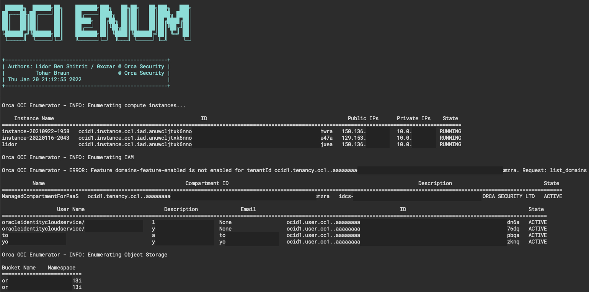

## Orca Oracle Enumeration Tool ##

## Disclaimer ##

This tool is for testing and educational purposes only.
Any other usage for this code is not allowed. Use at your own risk.
The author bears NO responsibility for misuse of this tool.
By using this you accept the fact that any damage caused by the use of this tool is your responsibility.

## Intro ##
OCI Enum is designed to help enumerate various services in Oracle Cloud Infrastructure.
It can use two modes of authentication - with user credentials, similarly to [OCI's official tool](https://docs.oracle.com/en-us/iaas/Content/API/Concepts/cliconcepts.htm) and using a compute instance's identity.
To obtain an instance's identity file, log on to the instance, and use `wget` (or another method of your choice) to download the json file from `http://169.254.169.254/opc/v1/identity`.

## Setup ##

### From PyPi ###
1. `pip install orca_oci_enum`
2. `oci-enum`

### From git
1. Clone this repository
2. Change directory to oci_enum
3. run `python setup.py install`
4. `oci-enum`

## To do ##
1. Add support for additional services
2. Add "Brute Force" mode to enumerate all available (read) permissions
