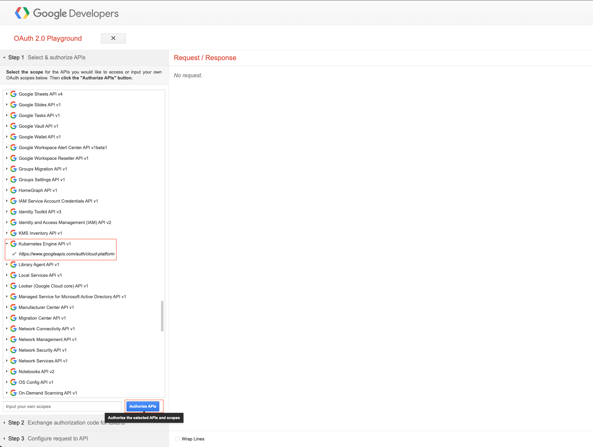
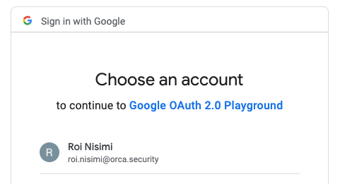
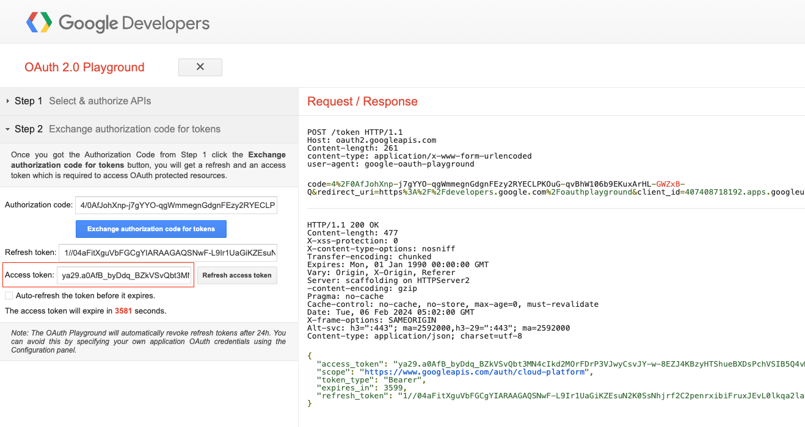

# sys-all-check

 

## Overview

You'll need to acquire an Oauth2.0 Google access token to carry this test. Running the script will open a new window of your default web browser on https://developers.google.com/oauthplayground/. Follow the below instructions to get a token with the `https://www.googleapis.com/auth/cloud-platform` API scope, and then copy and paste the token on the commandline input request.

The program outputs the vulnerable clusters.

### Acquire the access token

 
  


## Usage

Create a virtual environment and install all Python dependencies:

```
python3 -m venv venv
source venv/bin/activate (Unix / MacOS) // venv\Scripts\activate (Windows)
pip3 install -r requirements.txt
```

Then edit `clusters.txt` with your cluster IPs and then simply run:

```
python3 check.py
```

### Commands and Args

  `--no-browser` - will not open the OAuth Playground in a web browser